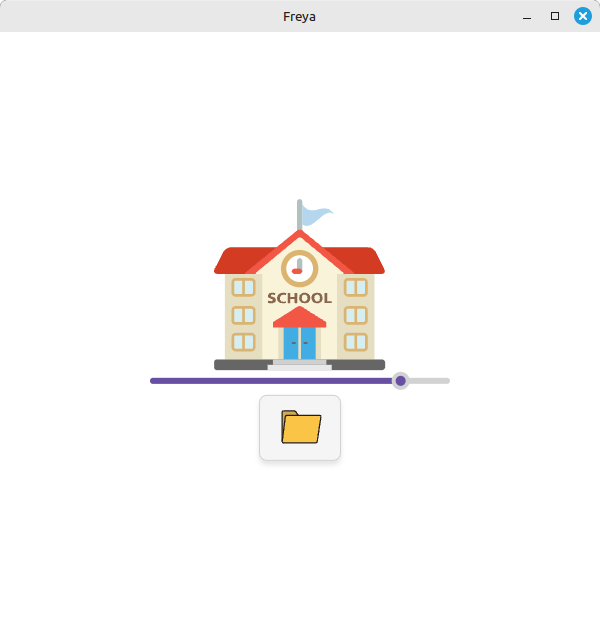

# Resize my Svg

Display your svg image and resize its preview with a slider.

## Limits

Please notice that as for now there's a little bug : the image must not set width and height inside the svg code.

## Building

### Windows

1. Ensure that you have Visual Studio 2022 (Community version is enough)
2. Install Rustup (choose option 1 : install via Visual Studio, then option 1 : default host triple)
3. Install cargo packager : `cargo install cargo-packager --locked` inside terminal
4. Build the exe file : `cargo packager --release` inside terminal in the root directory of this project
5. The built setup exe will be in folder **target/release**

### AppImage in a Docker container (Linux)

To build the AppImage in a Docker container (you may want to launch as sudo-user/root) :

1. `docker build -t resize_my_svg .`
2. `docker run --rm -v $(pwd)/output:/output -it resize_my_svg /bin/bash`

Inside the terminal of your container run :
1. `/home/docker_user/copy_executable.sh`
2. `exit`

## Credits

Using crab image from https://www.svgrepo.com/svg/396221/crab.

Using open image from https://www.svgrepo.com/svg/501815/open-open-a-file.

Using gallery image from https://icon-icons.com/fr/icone/image-paysage/53303.